# Week5Day4CelebrityFragmentsHW
Celebrity Fragments

Coding

Homework Week 5 Day 4
Create a multi pane app (add two fragment to the activity in a sequence)

- Fragment one should have a list of celebrity names.

- Fragment two should have the detail of the celebrity selected.

- Fragment two should be updated on each list item clicked

- Celebrity detail should have at least a picture of the celebrity (you can save all the images in the drawable folder), short description. But be creative to add more if you like.

- Use different attributes to make the design better.

- Do not use EventBus

Instructions:

- Run the Android project
- Create a new Virtual Device if not already. Then, choose Pixel 2 XL, then click OK.
- It will display the list of celebrities' names inside of the Recycler View on the top fragment.
- Click on any celebrities' name, it will display the selected celebrity's details page on the bottom fragment.
- Each time any of the celebrity is clicked, it will display his/her details.

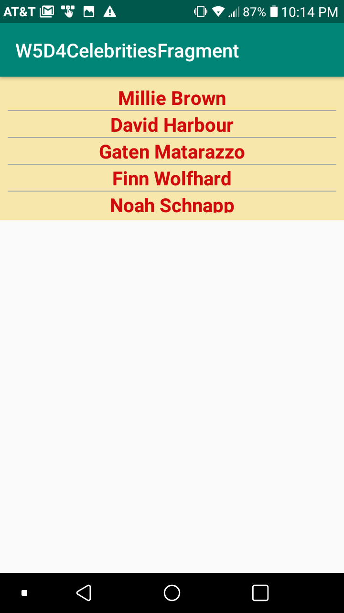
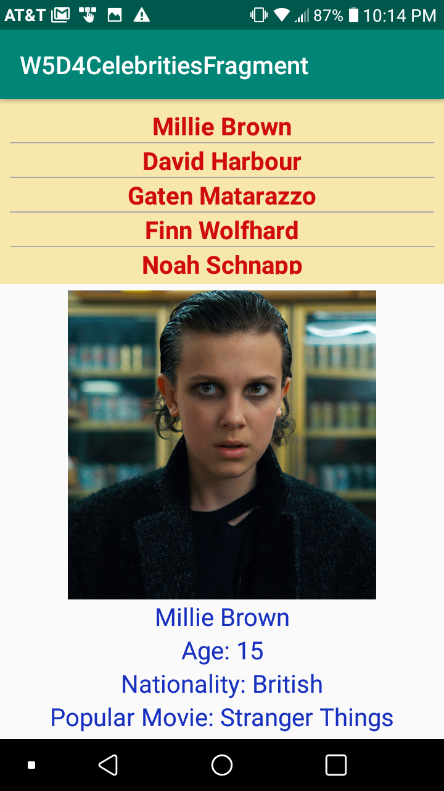
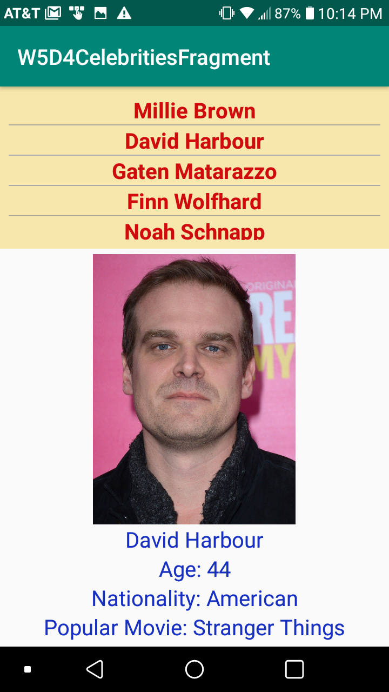
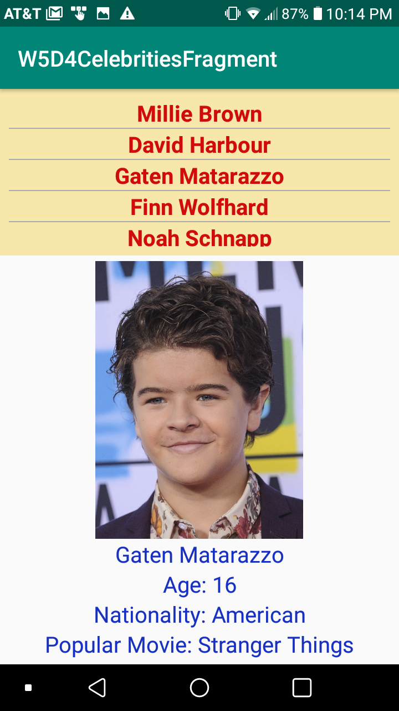
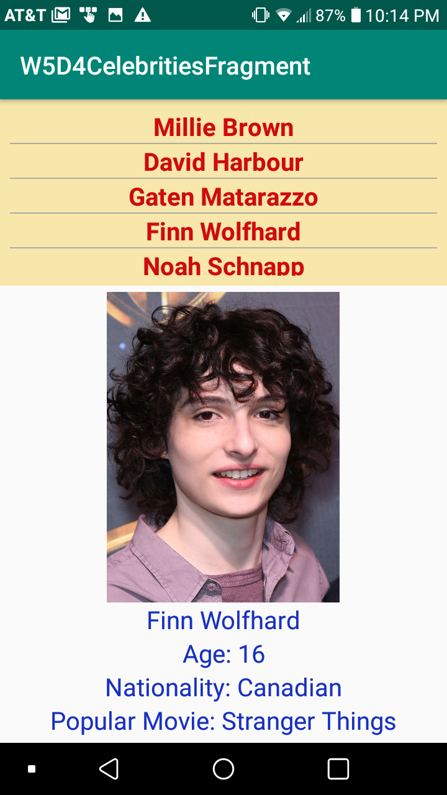
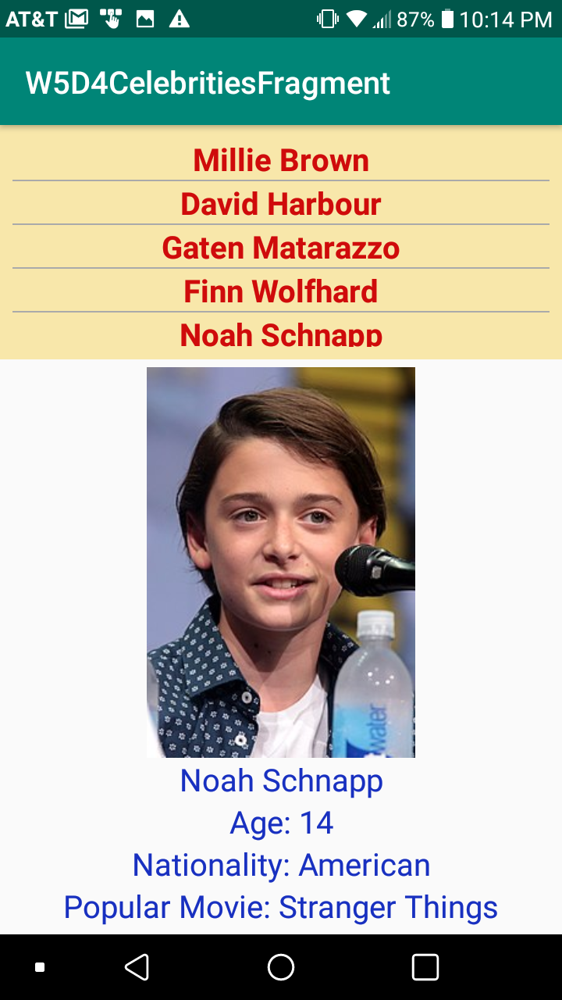
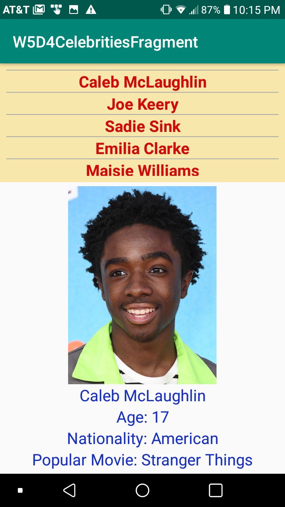
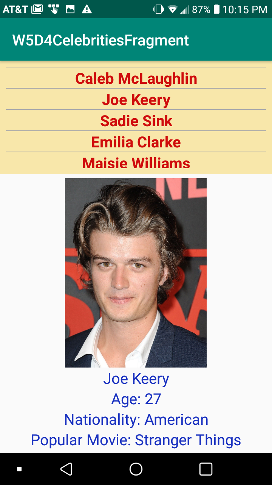
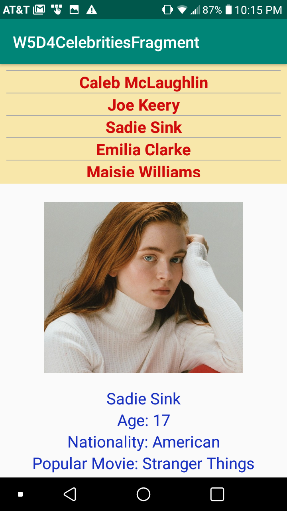
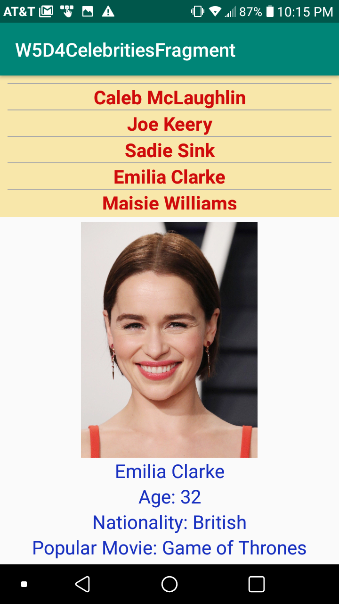
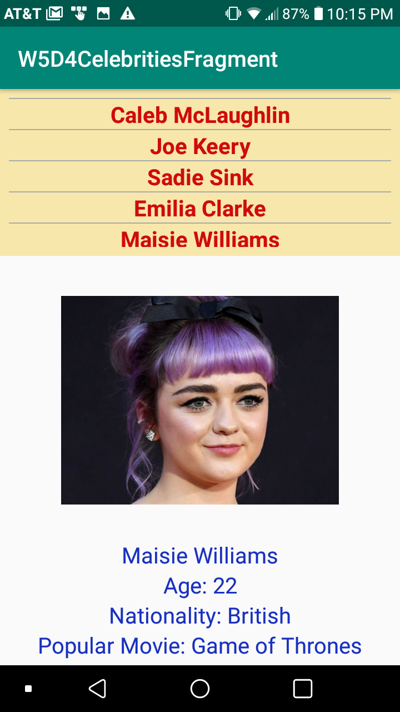
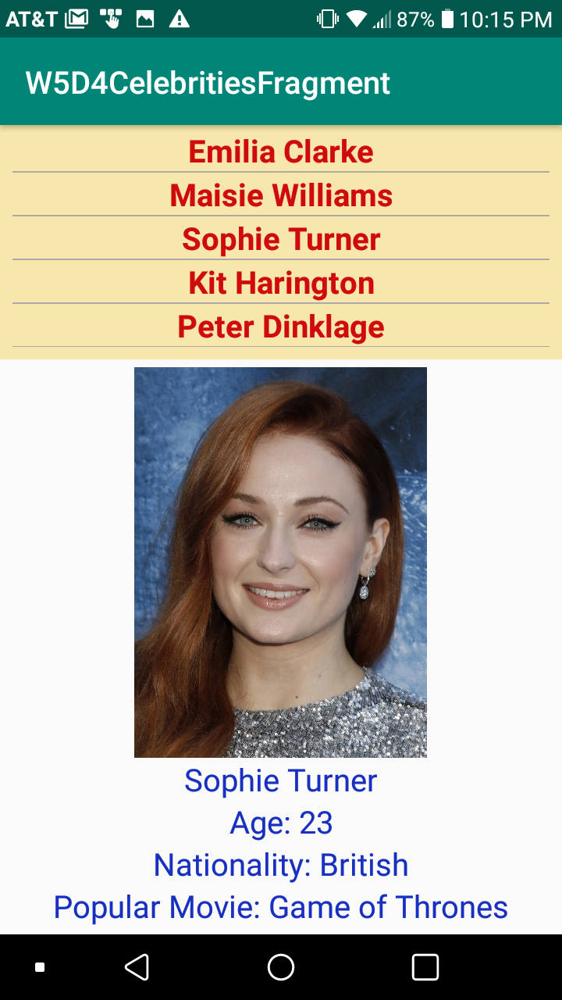
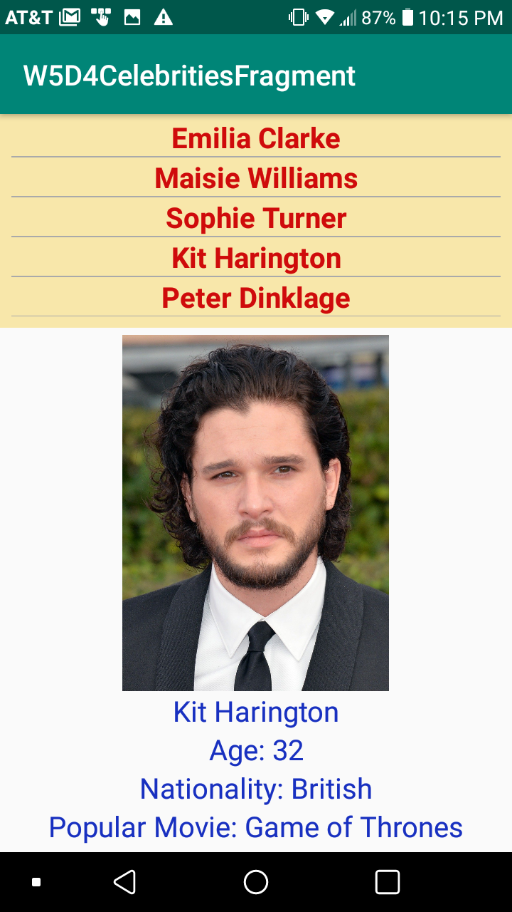
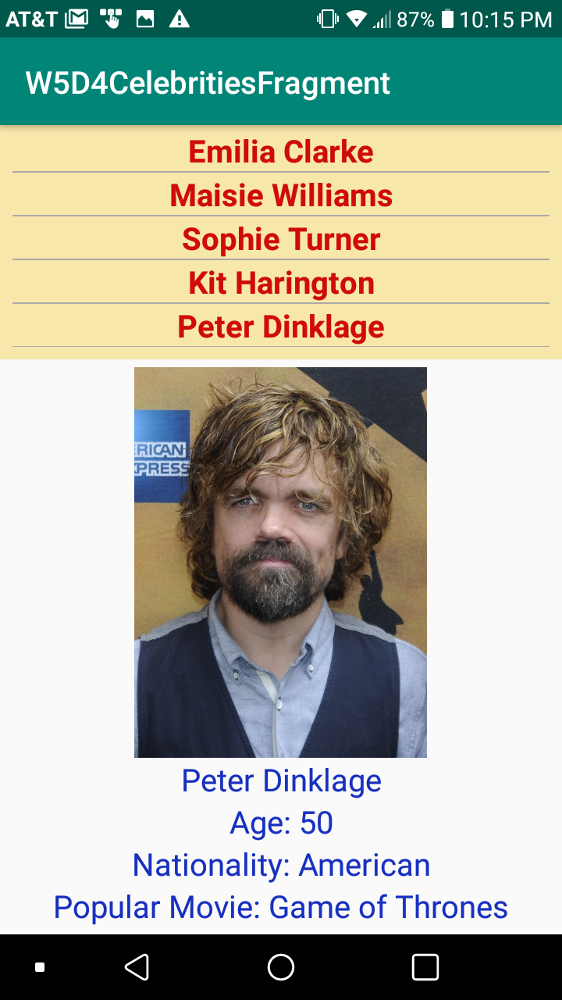
